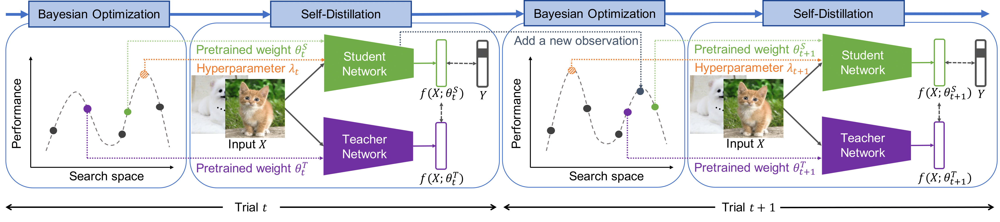

# Bayesian Optimization Meets Self-Distillation: BOSS (ICCV 2023)

[**HyunJae Lee***](https://scholar.google.com/citations?&user=m2mp1A8AAAAJ), [**Heon Song***](https://scholar.google.com/citations?&user=r_TfBoEAAAAJ), [**Hyeonsoo Lee***](https://scholar.google.com/citations?&user=BV-AwjoAAAAJ), **Gi-hyeon Lee**, **Suyeong Park**, [**Donggeun Yoo**](https://scholar.google.com/citations?user=10f-fEYAAAAJ).
*Equal Contribution

**Lunit Inc.**  

This is the official PyTorch implementation of the BOSS framework, presented at ICCV 2023. For technical details, please refer to:

**Bayesian Optimization Meets Self-Distillation**  
[Paper Link](https://arxiv.org/abs/2304.12666)  
ICCV 2023



## Introduction

Bayesian optimization (BO) has contributed greatly to improving model performance by suggesting promising hyperparameter configurations iteratively based on observations from multiple training trials. However, only partial knowledge (i.e., the measured performances of trained models and their hyperparameter configurations) from previous trials is transferred.

On the other hand, Self-Distillation (SD) only transfers partial knowledge learned by the task model itself. To fully leverage the various knowledge gained from all training trials, we propose the BOSS framework, which combines BO and SD. BOSS suggests promising hyperparameter configurations through BO and carefully selects pre-trained models from previous trials for SD, which are otherwise abandoned in the conventional BO process.

BOSS achieves significantly better performance than both BO and SD in a wide range of tasks including general image classification, learning with noisy labels, semi-supervised learning, and medical image analysis tasks.

## Environment Setup

The code has been run and tested on Ubuntu 18.04, Python 3.8, Pytorch 1.8.1, CUDA 11.1, 8 x RTX 2080Ti GPUs.

### Install Python Packages

```shell script
pip install -r requirements.txt
sudo apt-get update && sudo apt-get install sqlite3 libsqlite3-dev
```

### Training and Evaluation

```bash
python cifar.py -a vgg16_bn -d cifar100 --manualSeed 888  # baseline
python cifar_boss.py -a vgg16_bn -d cifar100 --manualSeed 888 --no-progress-bar  # BOSS
```

## Acknowledgement

- **PyTorch Classification**: Our codebase utilizes the [PyTorch Classification](https://github.com/bearpaw/pytorch-classification) repository for training and evaluation. Special thanks to the authors for their contribution.

## Citation

If you use this code in your research, please cite the following paper:

```bibtex
@article{lee2023bayesian,
  title={Bayesian Optimization Meets Self-Distillation},
  author={Lee, HyunJae and Song, Heon and Lee, Hyeonsoo and Lee, Gi-hyeon and Park, Suyeong and Yoo, Donggeun},
  journal={arXiv preprint arXiv:2304.12666},
  year={2023}
}
```

## License

<!-- TODO -->
